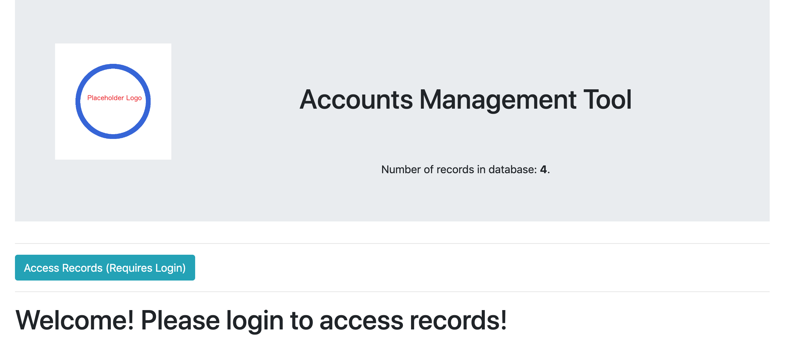
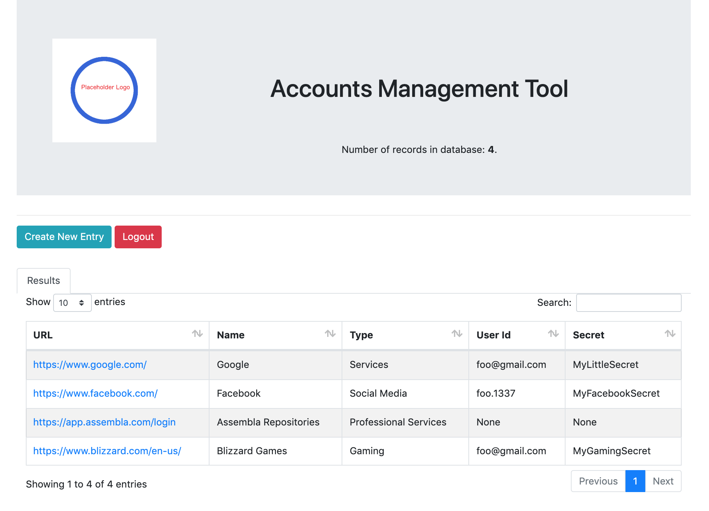
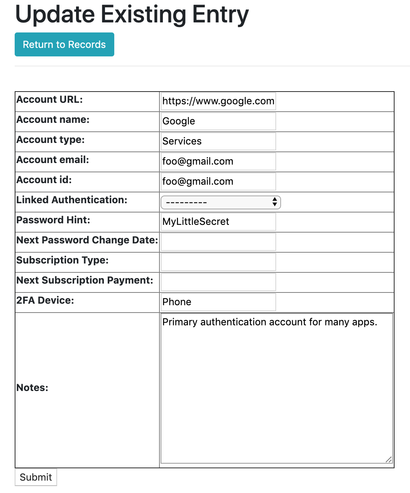

# Using the Tool

This documentation describes the processes and use-cases for the Account Management Tool. It will cover all currently supported features.

## Logging In

From the welcome screen, click on the "Access Records" button in order to log in for the tool.

The currently hard-coded administrator credentials are:

* Account Name: <em>foo</em>
* Account Password: <em>foof00foo</em> (zeros in between)

Successful login brings users to the secure list view of accounts as follows.

## The Record Table

### Interactions

* The Search bar will filter the results so only records with any text matching the search term will appear.
* Clicking on any of the header fields allow users to see the table sorted by that field. To toggle between ascending and descending views, just click again as needed.
* Table pagination can be adjusted and traversed.
* Clicking on any row allows users to edit the fields of the record on the clicked row. See "Edit Existing Record" below for details.
 
### Summary Field Semantics

* URL: The online link (if any) to the account. Clicking on the link opens it in a new browser tab. It is currently also treated as a click on a row (see above) which opens the details of the record in the original browser tab. This is not intended to remain the case.
* Name: The descriptive name of the account.
* Type: User defined type of the account.
* User Id: What user id the account requires for log-in. This can be an email address.
* Secret: A user self-hint on the password used. It is not advised for users to use the actual password here.

### Edit Existing Record

The fields should be reasonably straightforward.

* The "Return to Records" button allows the user to return to the view with a list of records without committing any changes made.
* Linked Authentication is a dropdown box that allows users to specify another existing account that provides authentication services for this one.
* The primary key of records is a combination of the URL (which is optional - for example, some government paper registry with no online presence,) and the user-specified name of the account (which is mandatory.)
* Clicking on the "submit" button will make a submission request to the database. This will either result in:
    * success, which redirects the user back to the list of records; 
    * or if there is some inconsistency with the requests, the user is returned back to this view with error messages in red, and offending fields highlighted.

## Creating A New Record

To create a new record, click on the "Create New Record" button on the main record list view.

Presents a view similar to edit above. None of the fields are pre-filled in this case. Success redirects the user back to the list of records.

## Working with a New Database

If desired, users can choose to:

* copy the file <em>db.sqlite3.empty</em> to <em>db.sqlite3</em> and restart the server. This is an empty database with the same admin name and password.
* shut down the server, run <em>python manage.py flush</em> to completely clear the current database. Then run <em>python manage.py createsuperuser</em> to create a new admin account.